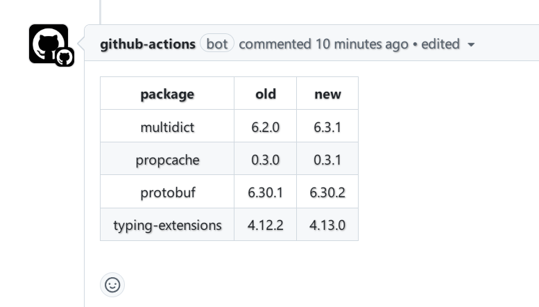

# action-uv-lock-diff-viewer

example:

```yaml
name: review

on:
  pull_request_target:
    branches:
      - master

jobs:
  lock:
    permissions:
      contents: read
      pull-requests: write
    runs-on: ubuntu-latest
    steps:
      - uses: trim21/action-uv-lock-diff-viewer@master
```


